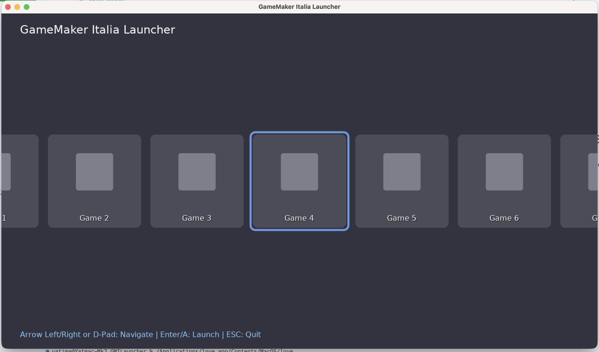

# GameMaker Italia Launcher

🚧 **IT'S CURRENTLY UNDER DEVELOPMENT** 🚧

This is a simple launcher made for the GMI community :)

Inspired by Nintendo Switch-style Launcher Ninty




## Add games

1. Create folder in /games
2. add metadata file
3. add cover.png

## Prerequisites

### Mac

Launch locally with:
```bash
/Applications/love.app/Contents/MacOS/love .
```

### Linux

TODO

### Windows

TODO


## License

The launcher license is in the LICENSE file

Each game has its respective author's license

